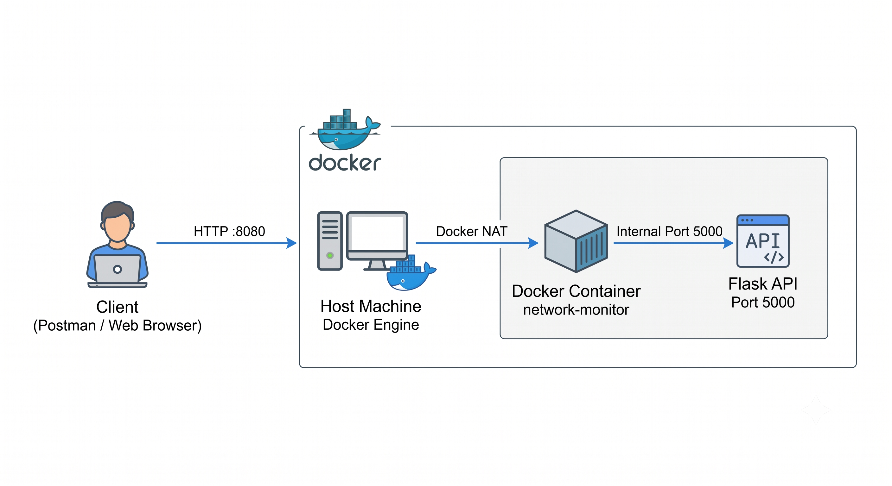
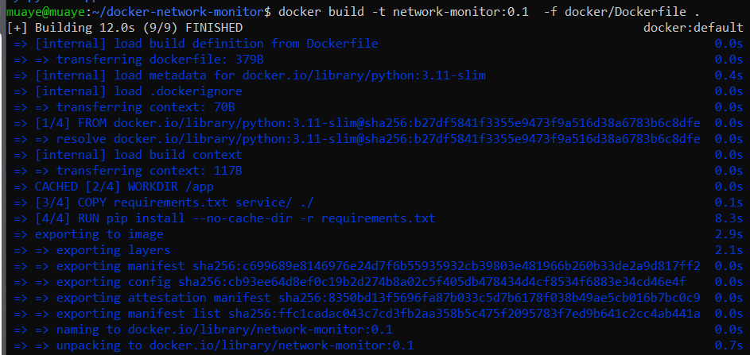
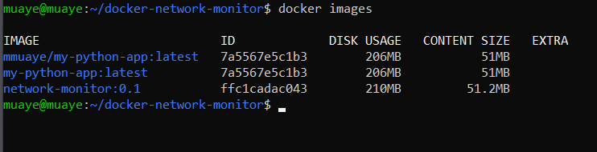
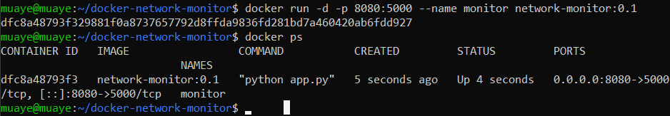
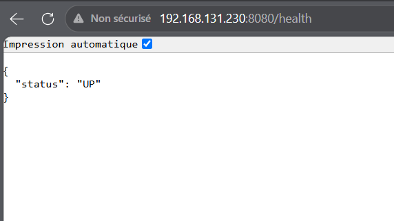
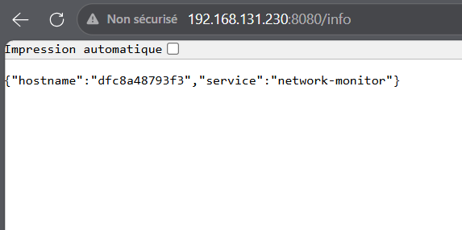

# 🐳 Docker Network Monitor

## 📌 Présentation du projet

Ce projet a pour objectif de mettre en place un **service de supervision réseau conteneurisé** à l’aide de Docker.
Il permet de comprendre les bases de la **virtualisation légère**, de l’exposition réseau via Docker et du test d’API à l’aide d’outils comme Postman ou un navigateur web.

Le projet simule un service réseau d’entreprise simple, accessible via HTTP.

---

## 🧱 Architecture du projet

L’architecture repose sur un conteneur Docker exécutant une API Flask, exposée via un port de la machine hôte.

### 📐 Diagramme d’architecture

Le diagramme ci-dessous illustre le fonctionnement global du projet, depuis le client jusqu’à l’API exécutée dans le conteneur Docker.



---

## 📁 Architecture des fichiers du projet

```text
docker-network-monitor/
├── service/
│   └── app.py
├── docker/
│   └── Dockerfile
├── requirements.txt
├── .dockerignore
├── .gitignore
└── README.md
```

---

## 🪜 Étape 1 — Préparation du projet

Après avoir reproduit l’architecture des fichiers ci-dessus, les différents fichiers du projet ont été créés :

- `app.py` : application Flask simulant un service réseau
- `Dockerfile` : définition de l’image Docker
- `requirements.txt` : dépendances Python
- `.dockerignore` : exclusion des fichiers inutiles lors du build Docker

---

## 🐳 Étape 2 — Création de l’image Docker

Une fois les fichiers prêts, l’image Docker est construite avec la commande suivante :

```bash
docker build -t network-monitor -f docker/Dockerfile .
```



### 🔍 Vérification de la création de l’image

La commande suivante permet de vérifier que l’image Docker a bien été créée :

```bash
docker images
```


---

## ▶️ Étape 3 — Lancement du conteneur Docker

Le conteneur est lancé à partir de l’image créée précédemment :

```bash
docker run -d -p 8080:5000 --name monitor network-monitor
```

### 🔍 Vérification du conteneur en cours d’exécution

La commande suivante permet de vérifier que le conteneur est bien en cours d’exécution :

```bash
docker ps
```



---

## 🌐 Étape 4 — Accès au service via navigateur / Postman

Une fois le conteneur lancé, le service est accessible via les adresses suivantes :

### 🔍 Health Check
```
http://192.168.131.230:8080/health
```

### ℹ️ Informations système
```
http://192.168.131.230:8080/info
```

### 📊 Statistiques réseau (simulation)
```
http://192.168.131.230:8080/metrics
```

Les requêtes retournent des réponses JSON simulant des métriques réseau provenant du serveur.





---

## 🧠 Analyse et conclusion

Ce projet permet de :

- Comprendre le cycle de vie d’un conteneur Docker
- Manipuler les ports et la redirection réseau (NAT)
- Déployer un service réseau isolé
- Tester une API exposée via HTTP
- Documenter un projet DevOps de manière claire et structurée

Il constitue une base solide avant d’aborder :
- Docker Compose
- Docker Swarm
- Déploiement sur AWS (EC2, ALB)
- Environnements virtualisés avec Proxmox

---

## 👨‍💻 Auteur

Projet réalisé dans un cadre d’apprentissage Docker, Réseaux et Virtualisation.
